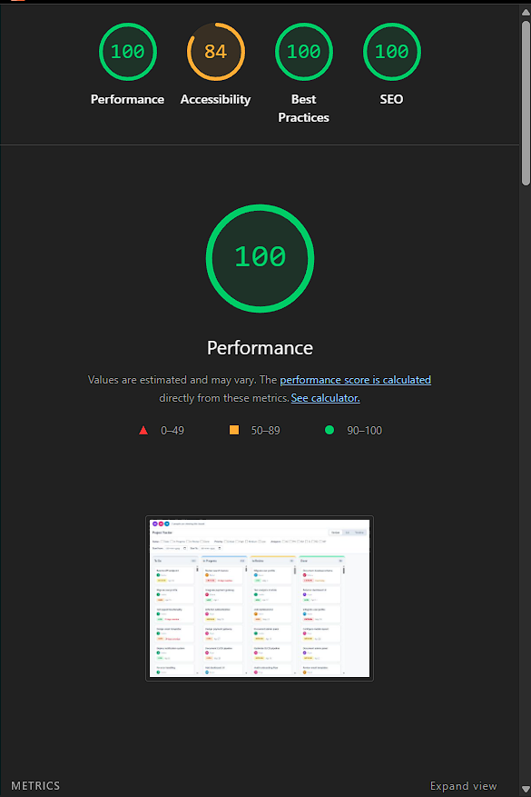

# Velozity Tracker

A multi-view project management UI built for a frontend engineering assessment. Features custom drag-and-drop, virtual scrolling, and live collaboration indicators — all built from scratch without UI or interaction libraries.

**Live Demo:** [your-vercel-url-here]

## Setup
```bash
git clone https://github.com/rasmusmaria26-cell/velozity-tracker.git
cd velozity-tracker
npm install
npm run dev
```

Open http://localhost:5173

## State Management — Why Zustand

Zustand was chosen over Context+useReducer for two main reasons. First, Zustand lets each component subscribe to only the slice of state it needs — a KanbanColumn re-renders only when its specific task subset changes, not when an unrelated filter or collaboration update fires. With 500 tasks across four columns, this matters. React Context would re-render every consumer on any state change, which quickly causes visible lag at this data scale. Second, Zustand has no Provider boilerplate or dispatch/action overhead, which keeps the four store files straightforward to read and extend.

## Virtual Scrolling

The custom `useVirtualScroll` hook keeps the DOM shallow regardless of dataset size. A single spacer div is sized at `totalCount × rowHeight` so the browser scrollbar reflects the full 500-task list. Only the rows visible in the viewport, plus a 5-row buffer above and below, are actually rendered — each absolutely positioned at `index × rowHeight` inside the spacer. On scroll, `scrollTop` updates synchronously and new start/end indices are recalculated immediately. The buffer prevents blank flashes on fast scroll by keeping rows slightly ahead of the viewport edge.

## Drag and Drop

Built entirely with the Pointer Events API — no libraries. On drag start, the card is hidden with `opacity: 0` and a same-height dashed placeholder div is inserted in its place to prevent column layout shift. A cloned ghost element is appended to `document.body`, escaping column `overflow: hidden`, and tracks the cursor position. `setPointerCapture` ensures `pointermove` keeps firing even when the pointer moves faster than the browser's hit-testing. Drop targets are identified by `data-column-status` attributes via `elementFromPoint`. On an invalid drop, the ghost transitions back to its `originRect`; a `setTimeout` fallback handles the edge case where `transitionend` does not fire.

## Lighthouse Score



